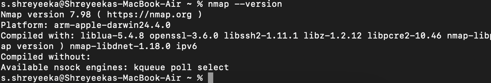

# Task 1: Scan Your Local Network for Open Ports

## Objective:
Learn to discover open ports on devices in your local network to understand network exposure.

## Tools:
- **Nmap** (free)
- **Wireshark** (optional, free)

---

## Guide
1. Install Nmap from official website
2. Find your local IP range (e.g., 192.168.1.0/24)
3. Run: nmap -sS 192.168.1.0/24 to perform TCP SYN scan
4. Note down IP addresses and open ports found
5. Optionally analyze packet capture with Wireshark
6. Research common services running on those ports
7. Identify potential security risks from open ports
8. Save scan results as a text or HTML file

---

## Installing Nmap
- **Visit the official website [Nmap](https://nmap.org/download) and download the appropriate version for OS**
- **In my case (on macOS):**
    - brew update
    - brew install nmap
- **Verifing the installation:**
    - nmap --version

